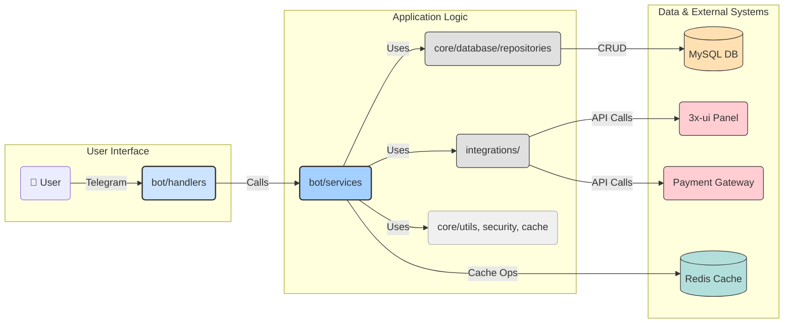

# MoonVPN System Architecture 🏗️ (v3 - Bot-Centric & Service/Repository)

This document outlines the architecture of the MoonVPN system, emphasizing the Telegram bot as the central interface and the Service-Repository pattern for backend logic and data access.

## System Overview

MoonVPN operates as a bot-centric application. The Telegram bot (`aiogram`) handles all user interactions (Clients, Sellers, Admins) and orchestrates operations by calling dedicated services. These services encapsulate business logic and interact with the database via repositories (`SQLAlchemy`, `Alembic`) and with external systems (like 3x-ui) through integration clients.

### Key Components

1.  **Telegram Bot Application (`bot/`)**: The core user interface and application logic driver.
    *   `handlers/`: Process incoming Telegram updates and map them to service calls.
    *   `services/`: Contain the core business logic (User, Panel, Client, Payment, etc.). They orchestrate data access (via repositories) and external API calls.
    *   `keyboards/`, `filters/`, `states/`, `middlewares/`: Support the bot's UI, flow control, and request processing.
    *   `main.py`: Initializes and runs the bot, dispatcher, routers, and services.
2.  **Core Components (`core/`)**: Foundation modules shared across the application.
    *   `config.py`: Manages application settings.
    *   `database/`:
        *   `session.py`: Provides asynchronous `SQLAlchemy` sessions.
        *   `models/`: Defines `SQLAlchemy` ORM models mirroring the database schema.
        *   `repositories/`: Implement the Repository Pattern, abstracting data access logic for each model. Each service typically depends on one or more repositories.
    *   `schemas/`: `Pydantic` schemas for data validation and transfer between layers.
    *   `security.py`, `logging_config.py`, `cache.py`, `exceptions.py`, `utils.py`: Provide shared utilities.
3.  **Integrations (`integrations/`)**: Clients for external services.
    *   `panels/xui_client.py`: Interacts with the 3x-ui panel API.
    *   `payments/`: Clients for payment gateways (e.g., Zarinpal).
4.  **Database (`MySQL 8.0+`)**: Persistent storage managed by `SQLAlchemy` and `Alembic`.
5.  **Caching (`Redis`)**: Used for `aiogram` FSM storage, potential data caching, and rate limiting.
6.  **Deployment (`Docker`)**: Containerized setup (Bot, DB, Redis) managed via `docker-compose.yml` and the `moonvpn` CLI script.

## Component Interaction Flow

**Explanation:**
1.  User interacts via Telegram.
2.  `Bot Handlers` receive the update, parse it, and call the appropriate `Service` method, passing necessary data (often using `Pydantic` schemas defined in `core/schemas/`).
3.  `Services` contain the business rules. They coordinate actions:
    *   They call `Repositories` to fetch or persist data in the `Database`.
    *   They call `Integration Clients` to interact with external systems (Panels, Payment Gateways).
    *   They use `Core Utilities` for tasks like hashing, caching, etc.
    *   They may use `Redis` for caching data retrieved from the database or external APIs.
4.  `Repositories` handle the specifics of `SQLAlchemy` queries (select, insert, update, delete) for their corresponding `Model`.
5.  `Integration Clients` handle HTTP requests/responses and API-specific logic.

## Data Flow Examples

### Client Provisioning Flow
1.  User selects plan via `Bot Handlers`.
2.  Handler calls `ClientService.create_client(user_id, plan_id, location_id)`.
3.  `ClientService`:
    *   Calls `PlanRepository.get_by_id(plan_id)` to get plan details.
    *   Calls `UserRepository.get_by_id(user_id)` to get user info.
    *   Calls `PanelService.select_panel_for_provisioning(location_id)` to get a suitable panel and inbound.
    *   Generates client details (UUID, remark, email).
    *   Calls `PanelService.add_client_to_panel(panel_id, inbound_id, client_details)`:
        *   `PanelService` uses `XuiPanelClient.add_client(...)`.
        *   `XuiPanelClient` makes the API call to 3x-ui.
        *   `PanelService` receives the result (including `panel_native_identifier` and `subscription_url`).
    *   Calls `ClientRepository.create(...)` to save the new client record in the `Database`, including `user_id`, `plan_id`, `panel_id`, `inbound_id`, `panel_native_identifier`, `expire_date`, etc.
4.  `ClientService` returns success/failure details (or raises an exception).
5.  Handler sends confirmation message and config details (formatted using `bot/utils/formatters.py`) to the user.

### Admin Sync Inbounds Flow
1.  Admin uses `/syncinbounds` command.
2.  `Admin Handler` calls `PanelService.sync_all_inbounds()`.
3.  `PanelService`:
    *   Calls `PanelRepository.get_all_active()` to fetch all active panels from the DB.
    *   For each panel:
        *   Uses `XuiPanelClient.login()` to authenticate.
        *   Uses `XuiPanelClient.get_inbounds()` to fetch inbound list from the panel API.
        *   Calls `PanelInboundRepository.sync_inbounds_for_panel(panel_id, fetched_inbounds)`:
            *   `PanelInboundRepository` compares fetched data with existing DB records, updates existing ones, adds new ones, and potentially marks missing ones as inactive.
4.  `PanelService` aggregates results.
5.  Handler sends a summary report to the admin.

## Design Principles

1.  **Bot-Centric Interface**: Telegram is the primary user interaction point.
2.  **Service Layer**: Encapsulates business logic (`bot/services/`). Services are the core orchestrators.
3.  **Repository Pattern**: Abstracts data persistence logic (`core/database/repositories/`). Services depend on repositories, not directly on `SQLAlchemy` models or sessions outside the repo layer.
4.  **Dependency Injection**: Services and repositories receive dependencies (like `AsyncSession` or other services/repositories) during instantiation (managed in `bot/main.py` or via a framework).
5.  **Clear Separation of Concerns**: Presentation (Handlers), Logic (Services), Data Access (Repositories), External Communication (Integrations).
6.  **Asynchronous**: Fully utilize `asyncio`.
7.  **Modularity & Testability**: Components are designed for independent testing and replacement.
8.  **Configuration Driven**: Use `core/config.py` for settings.
9.  **Schema Validation**: Use `Pydantic` (`core/schemas/`) for data validation between layers.
10. **User Experience**: Prioritize intuitive Persian bot interactions (`locales/`).

## Security Considerations

1.  **Authentication & Authorization**: Handled by `aiogram` middlewares (`bot/middlewares/auth.py`) checking user roles (`RoleRepo`) before allowing access to handlers/services.
2.  **Input Validation**: Use `Pydantic` schemas in services/handlers. Sanitize user input.
3.  **Data Encryption**: Encrypt sensitive configuration (panel passwords) using `core/security.py`.
4.  **Rate Limiting**: Implement via `aiogram` middleware and `Redis`.
5.  **Dependency Security**: Regularly scan dependencies.

## Performance & Scalability

1.  **Async Operations**: Ensure all I/O is non-blocking.
2.  **Database Optimization**: Efficient queries in repositories, proper indexing. Use `selectinload` or `joinedload` for relationships where appropriate.
3.  **Caching**: Leverage `Redis` (`core/cache.py`) for frequently accessed, rarely changing data (e.g., plans, locations, user roles) and potentially for panel API responses to reduce load.
4.  **Background Tasks**: Consider libraries like `arq` or Celery for long-running tasks (e.g., large-scale data syncs, notifications) if needed, to avoid blocking the main bot process.
5.  **Bot Scaling**: Multiple bot instances can be run if state (FSM) is managed centrally (e.g., `RedisStorage` in `aiogram`).

---
*This architecture aims for clarity, maintainability, and scalability within a bot-centric model.* 