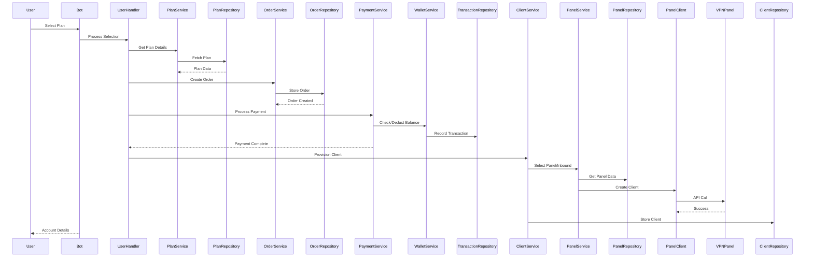

# MoonVPN System Architecture 🏗️ (v3 - Bot-Centric & Service/Repository)

This document outlines the architecture of the MoonVPN system, emphasizing the Telegram bot as the central interface and the Service-Repository pattern for backend logic and data access.

## System Overview

MoonVPN is a Telegram-based VPN service management system built around a bot-centric architecture. The application enables users to purchase, manage, and monitor VPN services directly through a Telegram bot interface, while administrators can manage panels, plans, and user accounts.

## Core Architecture Principles

1. **Bot-Centric Design**: All user interactions flow through the Telegram bot, eliminating the need for a separate frontend.
2. **Service-Oriented Structure**: Business logic is encapsulated in service classes that orchestrate repositories and external integrations.
3. **Repository Pattern**: Data access is abstracted through repositories, providing a clean separation from business logic.
4. **Clear Separation of Concerns**: The system follows a layered architecture with distinct responsibilities:
   - **Handlers**: Process Telegram updates and user interactions
   - **Services**: Implement core business logic
   - **Repositories**: Manage data persistence
   - **Integrations**: Connect to external systems (panels, payment gateways)

## Component Interaction Flow

```
User/Admin → Telegram Bot → Handler → Service(s) → Repository(ies)/Integration(s) → Database/External Systems
```

### Example: Client Account Creation Flow

1. User selects a plan and initiates purchase
2. `OrderService` creates an order and handles payment
3. On successful payment, `ClientService` provisions a new VPN account:
   - Selects appropriate panel and inbound via `PanelService`
   - Generates client details
   - Calls panel integration to create client on VPN panel
   - Stores client record in database via `ClientRepository`
4. User receives confirmation and connection details

### Discount Code Application Flow

1. User enters a discount code during checkout
2. `DiscountCodeService` validates the code:
   - Checks if code exists and is active
   - Verifies the code hasn't expired
   - Ensures usage limit hasn't been reached
   - Validates any user-specific restrictions
3. If valid, the discount is applied to the order:
   - `OrderService` calculates the final amount
   - The discount is recorded against the order
   - The discount code usage count is incremented
4. User sees the updated price with discount applied

## Key Components

### Bot Core (`/bot`)

The heart of the application, handling all Telegram interactions and orchestrating business logic.

#### Handlers
Process incoming Telegram updates and map them to appropriate service calls.

#### Services
Implement core business logic and orchestrate repositories and integrations.

#### Middlewares & Filters
Intercept updates for authentication, logging, and filtering based on user roles.

#### FSM (Finite State Machine)
Manages multi-step conversation flows (e.g., registration, purchase process).

### Core Components (`/core`)

Shared foundation used across the application.

#### Database Models
SQLAlchemy ORM models mapping to database tables.

#### Repositories
Data access layer implementing the repository pattern.

#### Schemas
Pydantic models for data validation and transfer.

#### Configuration
Environment-based configuration management.

### Integrations (`/integrations`)

Connectors to external systems.

#### Panel Clients
Interface with VPN panel APIs (e.g., 3x-ui).

#### Payment Gateways
Connect to payment processors (e.g., ZarinPal).

## Data Flow Examples

### Client Purchase Flow



## Order Management System

The Order Management System handles the entire lifecycle of user orders from creation to completion.

### Components:

1. **OrderRepository**: Handles data persistence for orders, including:
   - Creating new order records
   - Retrieving orders by ID, user, or status
   - Updating order status and details
   - Managing relationships with users, plans, and discount codes

2. **OrderService**: Implements business logic for orders:
   - Creating orders with appropriate validation
   - Processing payments and status transitions
   - Applying discount codes
   - Generating order statistics for admin dashboards
   - Coordinating with other services (Client, Payment, Notification)

3. **Order Schema**: Defines data validation and structure:
   - Core order attributes (ID, user, plan, status)
   - Financial details (amount, discount_amount, final_amount)
   - Timestamps for tracking order lifecycle
   - Validation logic for ensuring data integrity

### Order State Transitions:
```
PENDING → PROCESSING → COMPLETED
      ↘           ↘
        CANCELLED   FAILED
```

## Discount Code System

The Discount Code System enables flexible promotions and discounts for users.

### Components:

1. **DiscountCodeRepository**: Manages discount code data:
   - Creating and retrieving discount codes
   - Tracking usage counts
   - Validating discount code status and expiration
   - Managing relationships with orders and users

2. **DiscountCodeService**: Implements business logic for discounts:
   - Validating codes during checkout
   - Applying discounts to order amounts
   - Enforcing usage limits and expiration dates
   - Providing admin tools for discount management

3. **DiscountCode Schema**: Defines data structure and validation:
   - Code attributes (code, description, discount_type)
   - Value and constraints (discount_value, max_uses)
   - Temporal boundaries (start_date, end_date)
   - Validation logic for percentage vs. fixed amount discounts

### Discount Types:
- **Percentage**: Applies a percentage discount (e.g., 10% off)
- **Fixed Amount**: Applies a specific amount discount (e.g., 50,000 IRR off)

## Cloud Architecture (Future)

*[Details about potential cloud deployment, scaling strategies, and high-availability configurations would go here.]*

## Security Considerations

- **Authentication**: Role-based access control for bot commands
- **Data Protection**: Secure storage of panel credentials and user information
- **API Security**: Secure communication with external panels and payment gateways
- **Rate Limiting**: Protection against abuse through command throttling

## Resource Management

- **Database Connection Pooling**: Efficient handling of database connections
- **Redis Caching**: Performance optimization for frequently accessed data
- **Asynchronous Processing**: Non-blocking I/O for responsive user experience

## Monitoring & Logging

- **Structured Logging**: Comprehensive logging with context for troubleshooting
- **Admin Notifications**: Critical events sent to admin channels
- **Health Checks**: Regular verification of system components

## Design Principles

1.  **Bot-Centric Interface**: Telegram is the primary user interaction point.
2.  **Service Layer**: Encapsulates business logic (`bot/services/`). Services are the core orchestrators.
3.  **Repository Pattern**: Abstracts data persistence logic (`core/database/repositories/`). Services depend on repositories, not directly on `SQLAlchemy` models or sessions outside the repo layer.
4.  **Dependency Injection**: Services and repositories receive dependencies (like `AsyncSession` or other services/repositories) during instantiation (managed in `bot/main.py` or via a framework).
5.  **Clear Separation of Concerns**: Presentation (Handlers), Logic (Services), Data Access (Repositories), External Communication (Integrations).
6.  **Asynchronous**: Fully utilize `asyncio`.
7.  **Modularity & Testability**: Components are designed for independent testing and replacement.
8.  **Configuration Driven**: Use `core/config.py` for settings.
9.  **Schema Validation**: Use `Pydantic` (`core/schemas/`) for data validation between layers.
10. **User Experience**: Prioritize intuitive Persian bot interactions (`locales/`).

## Performance & Scalability

1.  **Async Operations**: Ensure all I/O is non-blocking.
2.  **Database Optimization**: Efficient queries in repositories, proper indexing. Use `selectinload` or `joinedload` for relationships where appropriate.
3.  **Caching**: Leverage `Redis` (`core/cache.py`) for frequently accessed, rarely changing data (e.g., plans, locations, user roles) and potentially for panel API responses to reduce load.
4.  **Background Tasks**: Consider libraries like `arq` or Celery for long-running tasks (e.g., large-scale data syncs, notifications) if needed, to avoid blocking the main bot process.
5.  **Bot Scaling**: Multiple bot instances can be run if state (FSM) is managed centrally (e.g., `RedisStorage` in `aiogram`).

## Recent Extensions & Subsystems

### Order Management System
The order management system handles the entire purchasing process, tracking state transitions from pending to completed, and integrating with the payment and discount systems. Key components:

- `OrderRepository`: Manages CRUD operations for orders, with specialized methods for retrieving orders by user, status, and discount code.
- `OrderService`: Orchestrates order creation, status updates, and discount code application.
- Related schemas: `OrderBase`, `OrderCreate`, `OrderUpdate`, `OrderRead`, and relationship-aware `OrderWithRelations`.

### Discount Code System
The discount system manages the creation, validation, and application of discount codes. Key components:

- `DiscountCodeRepository`: Handles persistence and validation of discount codes, including status, expiration, and usage count tracking.
- `DiscountCodeService`: Provides methods for creating, validating, and applying discount codes to orders.
- Supports two discount types: fixed amount and percentage-based discounts.
- Validates codes against expiration dates and usage limits.

Both systems follow the established architectural patterns with asynchronous operations, clear separation of concerns, and comprehensive error handling.

---
*This architecture aims for clarity, maintainability, and scalability within a bot-centric model.* 