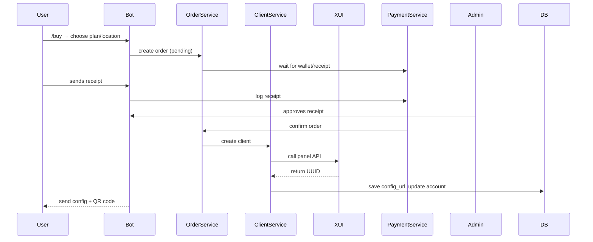

# 🔄 MoonVPN - Project Relationships Map

> Created: 2025-04-21
> Purpose: Provide a visual and conceptual understanding of how components, modules, and services interact in the MoonVPN ecosystem.

---

## 🧭 Layered Architecture Overview

```
User ↔ Telegram Bot ↔ Services ↔ Database ↔ External APIs (3x-ui)
```

- **User**: interacts with bot via commands/buttons
- **Bot**: interprets user inputs and routes to proper service
- **Services**: core logic, DB operations, validations, external calls
- **DB**: persistence layer (users, plans, receipts, etc.)
- **3x-ui API**: manages VPN accounts and inbounds on remote panels

---

## 🧩 Module Relationships

### Telegram Bot Layer (`/bot`)
- `commands/` → Routes bot commands like `/start`, `/buy`
- `buttons/`, `callbacks/` → Handle inline keyboard flows
- `keyboards/` → ReplyKeyboard layouts (navigation, wallet, etc.)
- `middlewares/` → Inject role-based access, auth
- `notifications/` → Dispatch messages from other modules
- `receipts/` → Handles receipt collection & forwarding to admins

### Core Logic (`/core/services`)
Each service here maps to 1–3 models and their logic:

| Service | Uses | Triggers |
|---------|------|----------|
| `UserService` | `User`, `TestAccountLog` | `/start`, `/profile` |
| `PlanService` | `Plan`, `DiscountCode` | `/plans`, `/buy` |
| `PanelService` | `Panel`, `Inbound` | Sync cronjob, Admin panel |
| `ClientService` | `ClientAccount`, `AccountTransfer` | After buy/extend |
| `PaymentService` | `Transaction`, `BankCard`, `ReceiptLog` | Wallet/payments |
| `NotificationService` | `NotificationLog` | All events |
| `OrderService` | `Order`, links to `ClientAccount`, `ReceiptLog` | Purchase flow |

### Integrations (`/core/integrations/xui_client.py`)
All methods to connect to 3x-ui panels and manage:
- Add/edit/remove clients
- Fetch inbounds & stats
- Sync remote data to DB

---

## 🗄️ Database Entity Relations

| From | To | Type | Description |
|------|----|------|-------------|
| `User` | `ClientAccount` | 1:N | Each user may own several VPNs |
| `User` | `Transaction` | 1:N | Each recharge/purchase logged |
| `User` | `Order` | 1:N | Each order relates to user |
| `Panel` | `Inbound` | 1:N | Each server offers inbounds |
| `Inbound` | `ClientAccount` | 1:N | Clients use inbounds |
| `Plan` | `Order` | 1:N | Order created from plan |
| `Order` | `ClientAccount` | 1:1 | Fulfilled via one config |
| `BankCard` | `ReceiptLog` | 1:N | Each receipt tied to a card |
| `ReceiptLog` | `Order`/`Transaction` | M:1 | Reference link |

---

## 🔁 Data Flow Example - Purchase



---

## 🔐 Security Notes
- DB updates only through services
- No direct access to panel APIs from bot
- Access to `/core/integrations` must remain restricted to services

---

## 📎 Related Docs
- `project-structure.md`
- `project-requirements.md`
- `database-structure.md`

---

> 💡 Use this map as a foundation for debugging, onboarding new devs, and guiding AI assistants like Claude or GPT through the architecture.

