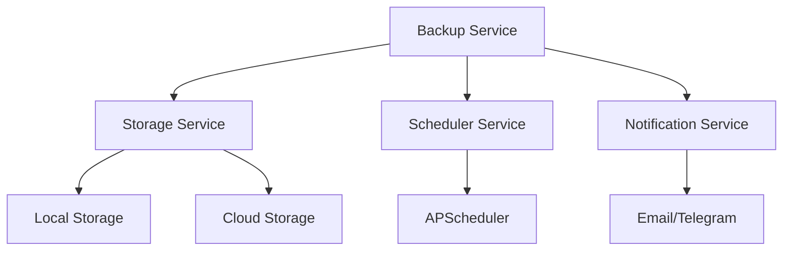
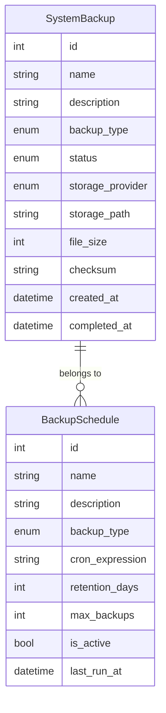
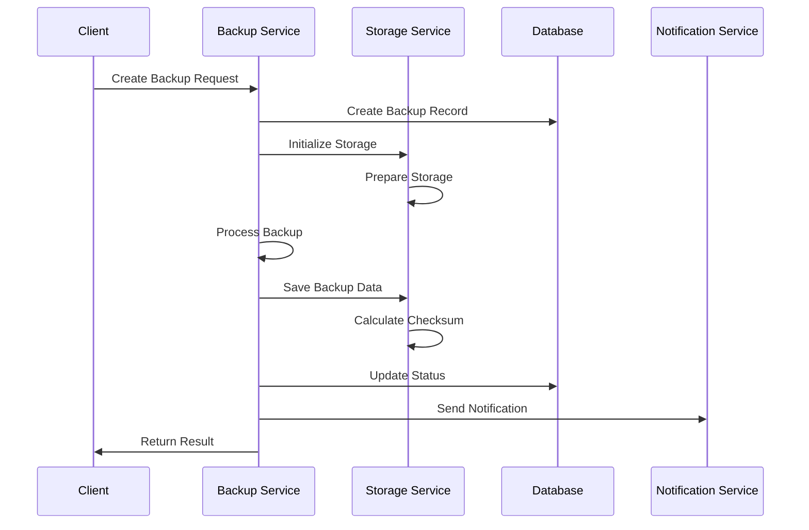
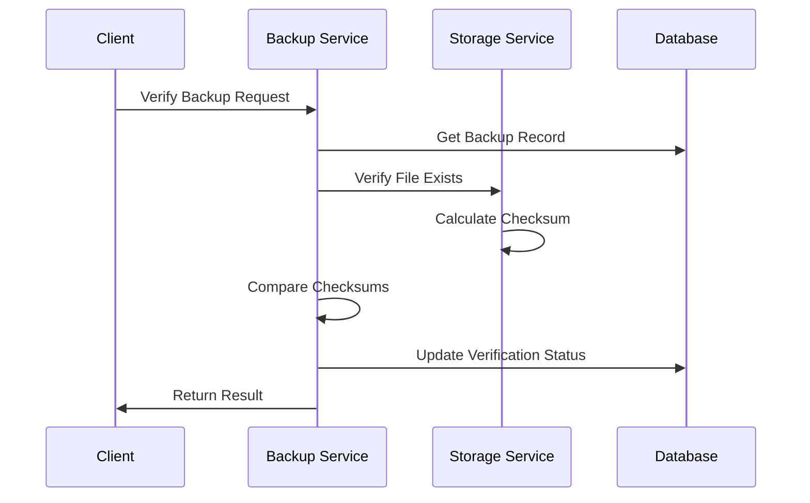
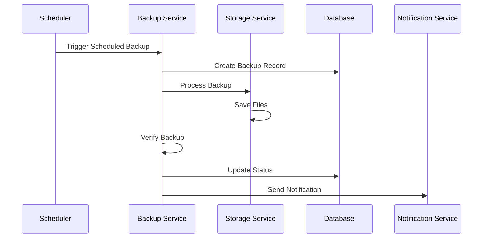
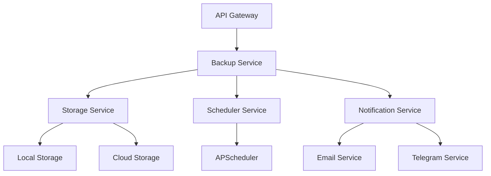

# Backup System Architecture

## System Overview

The MoonVPN Backup System is designed to provide robust, scalable, and secure backup functionality for the entire application. The system supports multiple backup types, storage providers, and automated scheduling with comprehensive monitoring and verification capabilities.

## Architecture Components

### 1. Core Components



#### Backup Service
- **Purpose**: Central orchestrator for backup operations
- **Responsibilities**:
  - Backup creation and management
  - Backup verification
  - Backup restoration
  - Schedule management
  - Status tracking
- **Key Features**:
  - Support for multiple backup types
  - Automated scheduling
  - Verification system
  - Error handling
  - Retention management

#### Storage Service
- **Purpose**: Abstract storage operations across providers
- **Responsibilities**:
  - File operations (save, read, delete)
  - Storage provider management
  - File integrity verification
  - Metadata management
- **Supported Providers**:
  - Local file system
  - Amazon S3 (future)
  - Azure Blob Storage (future)
  - Google Cloud Storage (future)

#### Scheduler Service
- **Purpose**: Manage automated backup schedules
- **Responsibilities**:
  - Schedule creation and management
  - Job execution
  - Schedule tracking
  - Error handling
- **Features**:
  - Cron-based scheduling
  - Multiple schedule support
  - Failure recovery
  - Schedule persistence

### 2. Data Models



#### SystemBackup
- Primary model for backup records
- Tracks backup metadata and status
- Manages backup lifecycle
- Stores verification information

#### BackupSchedule
- Manages automated backup schedules
- Controls retention policies
- Tracks execution history
- Manages schedule status

### 3. Process Flows

#### Backup Creation Flow


#### Backup Verification Flow


#### Scheduled Backup Flow


## Technical Implementation

### 1. Database Schema

```sql
-- System Backups
CREATE TABLE system_backups (
    id SERIAL PRIMARY KEY,
    name VARCHAR(255) NOT NULL,
    description TEXT,
    backup_type VARCHAR(20) NOT NULL,
    status VARCHAR(20) NOT NULL,
    storage_provider VARCHAR(20) NOT NULL,
    storage_path VARCHAR(1024) NOT NULL,
    file_size BIGINT,
    checksum VARCHAR(64),
    error_message TEXT,
    metadata JSONB,
    schedule_id INTEGER REFERENCES backup_schedules(id),
    created_at TIMESTAMP WITH TIME ZONE NOT NULL DEFAULT NOW(),
    started_at TIMESTAMP WITH TIME ZONE,
    completed_at TIMESTAMP WITH TIME ZONE,
    verified_at TIMESTAMP WITH TIME ZONE,
    expires_at TIMESTAMP WITH TIME ZONE,
    created_by INTEGER NOT NULL REFERENCES users(id),
    updated_by INTEGER NOT NULL REFERENCES users(id),
    verified_by INTEGER REFERENCES users(id)
);

-- Backup Schedules
CREATE TABLE backup_schedules (
    id SERIAL PRIMARY KEY,
    name VARCHAR(255) NOT NULL,
    description TEXT,
    backup_type VARCHAR(20) NOT NULL,
    storage_provider VARCHAR(20) NOT NULL,
    storage_path VARCHAR(1024) NOT NULL,
    cron_expression VARCHAR(100) NOT NULL,
    retention_days INTEGER NOT NULL DEFAULT 30,
    max_backups INTEGER NOT NULL DEFAULT 10,
    is_active BOOLEAN DEFAULT TRUE,
    last_run_at TIMESTAMP WITH TIME ZONE,
    next_run_at TIMESTAMP WITH TIME ZONE,
    error_count INTEGER DEFAULT 0,
    last_error TEXT,
    metadata JSONB,
    created_at TIMESTAMP WITH TIME ZONE NOT NULL DEFAULT NOW(),
    updated_at TIMESTAMP WITH TIME ZONE,
    created_by INTEGER NOT NULL REFERENCES users(id),
    updated_by INTEGER NOT NULL REFERENCES users(id)
);
```

### 2. Configuration

```python
class BackupConfig:
    # Storage Settings
    STORAGE_PROVIDER = "local"
    LOCAL_STORAGE_PATH = "/var/backups/moonvpn"
    
    # Backup Settings
    MAX_BACKUP_SIZE = 1024 * 1024 * 1024  # 1GB
    COMPRESSION_ENABLED = True
    ENCRYPTION_ENABLED = True
    
    # Schedule Settings
    DEFAULT_RETENTION_DAYS = 30
    MAX_CONCURRENT_BACKUPS = 5
    
    # Verification Settings
    VERIFY_AFTER_BACKUP = True
    VERIFICATION_TIMEOUT = 3600  # 1 hour
    
    # Notification Settings
    NOTIFY_ON_SUCCESS = True
    NOTIFY_ON_FAILURE = True
    NOTIFICATION_CHANNELS = ["telegram", "email"]
```

### 3. Security Measures

#### Data Protection
- Encryption at rest
- Secure transfer protocols
- Access control
- Audit logging
- Secure deletion

#### Access Control
- Role-based access
- API authentication
- Operation logging
- IP restrictions
- Rate limiting

#### Storage Security
- Provider authentication
- Encrypted credentials
- Secure connections
- Access logging
- Permission management

### 4. Monitoring and Metrics

#### System Metrics
- Backup success rate
- Average backup size
- Backup duration
- Storage usage
- Error frequency

#### Performance Metrics
- Processing time
- Transfer speed
- Compression ratio
- Resource usage
- Queue length

#### Health Checks
- Storage availability
- Service status
- Schedule status
- Resource status
- Network status

## Deployment Architecture

### 1. Component Distribution



### 2. Scaling Considerations

#### Horizontal Scaling
- Multiple backup workers
- Load balancing
- Queue-based processing
- Distributed storage
- Service redundancy

#### Vertical Scaling
- Resource allocation
- Performance tuning
- Storage optimization
- Memory management
- CPU utilization

### 3. Disaster Recovery

#### Backup Recovery
- Multiple storage locations
- Backup verification
- Recovery testing
- Rollback procedures
- Data consistency

#### Service Recovery
- High availability
- Automatic failover
- Service monitoring
- Error recovery
- State management

## Maintenance and Operations

### 1. Regular Tasks
- Monitor backup status
- Verify backup integrity
- Clean up old backups
- Check storage usage
- Update schedules

### 2. Troubleshooting
- Error investigation
- Log analysis
- Performance monitoring
- Resource checking
- Security auditing

### 3. Updates and Upgrades
- Service updates
- Security patches
- Feature additions
- Configuration changes
- Documentation updates 